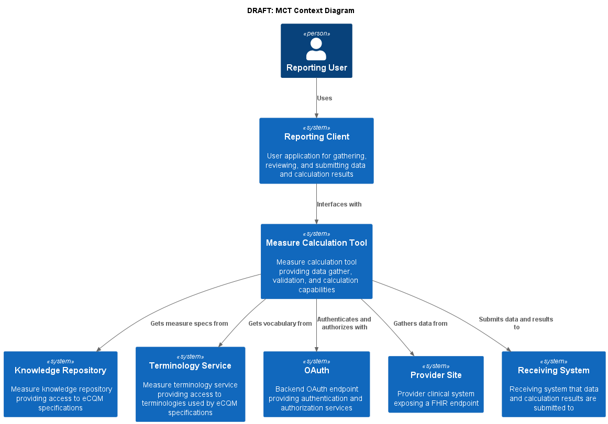
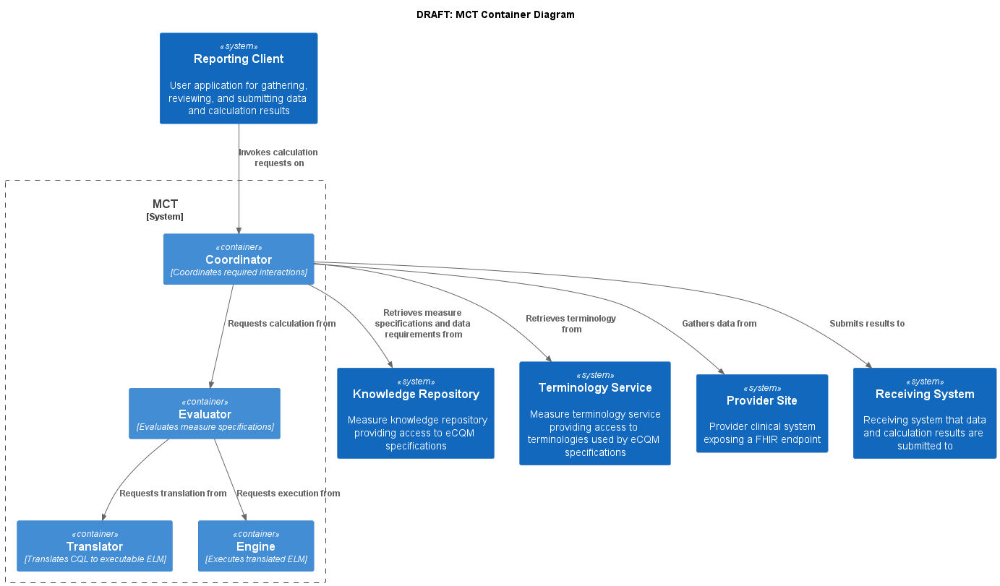

### Technical Requirements

#### Introduction

This Technical Requirements Document (TRD) documents both the high-level system design and the low-level detailed design specifications. In addition, this TRD describes design goals and considerations, specifications, and an overview of the system architecture. It also describes the information architecture and data structures associated with the system, in addition to human-machine interface and operational scenarios. The high-level system design is further decomposed into low-level detailed design specifications for each system component. Design documents are incrementally and iteratively produced during the system development life cycle, based on the circumstances of the information technology (IT) project and the system development methodology used for developing the system. This document is intended for technical stakeholders involved in the implementation of this system including developers, project managers, users, testers, and documentation writers. Some portions of this document, such as the user interface (UI), may be useful to share with the client/user and other stakeholders whose input/approval into the UI is needed.

#### General Overview and Design Guidelines

##### Background

_Situation_

The Promoting Interoperability Program Eligible incentivizes eligible hospitals and providers to demonstrate meaningful use of certified health information technology (HIT) to improve quality, safety, efficiency, and equity of the American health care system. Hospitals participating in the inpatient hospital quality reporting program (IHQR) are encouraged to voluntarily submit 4, electronic clinical quality measures (eCQM) for 3 of 4 quarters.  

_Problem_

However, the process of electronically sharing population-level data is labor-intensive and cumbersome, hampered by a lack of standardization of data models and fields. In order to calculate eCQMs today, providers must map their EHR propriety data models to the Quality Data Model and upload their results as a Quality Reporting Document Architecture Category I formatted file onto the Hospital Quality Reporting portal, as well as participate in post submission audits. 

In order to reduce the burden of data collection and improve interoperability, CMS aims to transition away from traditional electronic clinical quality measurement (eCQM) to Fast Healthcare Interoperability Resources (FHIR)– specified measures, that leverage certified health information technology or digital quality measurement (dQMs)  

As per the 21st Century Cures Act Final Rule, developers of certified health information technology (HIT) must ensure their technology supports a variety of use cases, including the calculation of quality measure. **Technology certified by the Office of National Coordinator ONC must support “standardized API for patient and population services.”** Certified HIT will  

1. support Fast Healthcare Interoperability Resources (FHIR) Release 4.0.2, 
2. responds to request for data elements mandated in the USCD v1 
3. enables access to patient-level data across a patient population.  

DQMs will allow eligible providers and hospitals to seamlessly exchange patient and population level data for the calculation and reporting of quality measure scores, using a measure calculation tool (MCT). 

An MCT is an open-source, end-to-end software platform, designed to interface with eligible hospital and clinicians FHIR API, gather data requirements for measure calculation from a knowledge repository, request and validate data from a provider API, calculate measure score(s) using clinical query language, and produce electronic report(s). CMS has contracted Yale-CORE to orchestrate the development of an early MCT prototype and demonstrate its ability to calculate a measure score for single-FHIR specified measures.  

_Objective_

To develop a prototype of the MCT engine that will be able to demonstrate key features of the enterprise level MCT platform. These features will be defined and enumerated as user stories, all features not selected for development and testing for prototype will remain in the backlog.  

_Stakeholders_

The following comprises the internal and external stakeholders whose requirements are represented by this document: 

1. Bridget Calvert 
2. Joel Andress 
3. ISG – Tom Lantz and Anne Weinstein 
4. HQR – Michellene Roberts- adhoc 
5. Bill Lanken 

##### General Overivew

##### Assumptions/Constraints/Risks

###### Assumptions

1. Calculate a single hospital-level-process measure 
2. Have a User interface similar to Hospital Quality Reporting webpage 
3. MCT Host is agnostic 
4. It will connect to US core Compliant FHIR Server for mock reporting system 
5. It will connect to server with DEQM receiver capabilities as a mock receiving system 
6. It will use smart on FHIR  or O Auth for authorization 
7. The prototype will use synthetic data 
8. It will contain internal bundles of  knowledge repository (measure specification support) 
9. It will contain internal bundles terminology service 
10. TBD: use bulk FHIR 
11. Hospitals with multiple locations operating under a single CCN will submit reports for all locations 
12. Hospitals user can select measures for reporting (see 1st assumption) 
13. TBD: connect to Compliant FHIR server that has aggregated patient data 
14. TBD: measure calculation occurs on data in transit 
15. Debatable? MCT does not store data it exchanges data 

###### Constraints

1. The Measure Calculation Tool solution must be open source

###### Risks

##### Alignment with Enterprise Architecture

#### Design Considerations

##### Goals and Guidelines

##### Development Methods and Contingencies

Scrum is an Agile methodology that allows the project team to focus on delivering the highest business value in the shortest time. It allows the project team to rapidly and repeatedly inspect actual working software (every 2 weeks). The business sets the priorities, and teams self-organize to determine the best way to deliver the highest priority features. Every 2 weeks any stakeholder can see real working software and decide to release it as is or continue to enhance it for another sprint. This rapid and iterative approach has been quickly gaining acceptance within the informatics community (Kannan et al., 2019).

This project also used a "Continuous Delivery" pipeline to support project development as has been commonly employed by industry leaders like Amazon, Netflix, eBay, Comcast, and Uber for over 10 years. This approach consistently reduces:

Environment dependency risks through the use of lightweight virtual machines (Containers)
Environment hosting risks by using automated and immutable servers
Testing risks by using automated testing with Continuous Quality Improvement
Deployment risks by using incremental rollout and instantaneous rollback
Versioning risks by using microservices and volatility decomposition
Overall project-related risks by implementing both a high-level overview (e.g., Waterfall) executed in Agile development cycles

##### User Interface Approach

##### Architectural Strategies

This project uses the C4 modeling (Brown, n.d.) as an approach to define and document the system architecture: Context, Container, Component, Code (C4). More information on C4 modeling and its use is publicly available (https://c4model.com/)

This project will also use industry standard, open source, and widely available development tools and technologies, including:

* [JavaScript](https://en.wikipedia.org/wiki/ECMAScript)
* [React](https://reactjs.org/)
* [Java 11 (Adopt Open JDK and OpenJ9)](https://adoptopenjdk.net/?variant=openjdk11&jvmVariant=openj9)
* [Github](http://github.com)

###### Standards Compliance

As described in the design Constraints section (above), this project’s approach is to choose standards-based approaches, whenever possible, between the Measure Calculation Tool and the clinical systems with which it interacts. However, when building functionality for the project, there are two considerations that the project must address:

1. **Standards Gaps** - When an existing specification does not support the functionality required
2. **Adoption Gaps** - When a standard specification exists, but is not widely implemented

##### Performance Engineering

#### System Architecture and Design

##### Logical View

The following diagram provides the context of the proposed measure calculation tool in the environment in which it is intended to function. The reporting user is shown interacting with the system through the Reporting Client, which interacts with the Measure Calcuation Tool to gather data, perform validation and measure calculation, and submit the resulting data and scores to the receiving system.

]

As shown in the digram, a Reporting User uses the Reporting Client to interface with the Measure Calculation Tool to select reporting facilities, the measure to be calculated, and the measurement period to be reported. The user interface displays the results of the validation step, including whether the data meets the data requirements for the measure to be reported, as well as any validation information returned by the measure calculation tool and the calculated measure score. The user is given the opportunity to review validation results to determine whether additional corrective action needs to be taken by the provider sites, or if the data meet expectations and the measure calculation score is accepted, the user is able to transmit the results to the Receiving System.

To complete the required gather, validation, and calculation, the Measure Calculation Tool interfaces with the Knowledge Repository, Terminology Service, Provider Site(s), and Receiving System.

The Measure Calculation Tool makes use of the Knowledge Repository to retrieve measure specifications as well as data requirements for the specific measure or measures being calculated. This interface is described by the Measure Repository Service defined in the Quality Measure Implementation guide.

The Terminology Service is used to provide appropriate expansions of value sets referenced by the measure specification. This interface is described by the Measure Terminology Service defined in the Quality Measure Implementation guide.

The Measure Calculation Tool accesses the Provider Site (or sites) via the FHIR Server exposed by each provider site. Consistent with current adoption, the provider site FHIR server is expected to conform to at least the 3.1.1 version of the US Core FHIR implementation guide. Ideally, provider sites would also conform to newer versions of US Core, as well as to the QI Core implementation guide.

And finally, the Measure Calculation Tool interfaces with the Receiving System as described by the Receiving System capability statement defined in the Data Exchange for Quality Measures implementation guide.

> Note that for the purposes of this prototype, the capabilities provided by the Knowledge Repository and Terminology Service are modeled and implemented as interfaces within the Measure Calculation Tool, as the ecosystem for publishing quality measures via an API is not yet established and outside the scope of this prototype.

###### MCT Container

The following diagram illustrates the container level of the measure calculation tool, depicting the interactions it has with external systems:

As shown in the diagram, the Measure Calculation Container provides the implementation of the measure calculation tool, as well as support for configuration information required to support the calculation, including reporting provider information, available measures for calculation, as well as facility and receiving system endpoints.

The Reporting Client makes use of these services to allow users to perform end-to-end measure calculation and reporting, and to facilitate data and calculated score validation.

Externally, the Measure Calculation Tool container must interface with the Knowledge Repository, Terminology Service, Provider Site(s), and Receiving System. Again, for the purposes of this prototype, the functionality provided by the Knowledge Repository and Terminology Service is modeled and implemented as interfaces within the Measure Calculation Tool.

###### MCT Coordinator Component

The following diagram illustrates the coordinator component of the measure calculation tool:

As shown in the diagram, the Reporting Client interfaces with the coordinator component to provide measure calculation and reporting services to the end user.

The Coordinator component is responsible for accepting calculation and submission requests, managing the data flow required to support the requested calculation, and returning responses from the calculation process. The coordinator makes use of the Knowledge Repository Interface to request measure specifications and data requirements processing, the Terminology Service Interface to request value set expansion, the Provider Interface to request data from each facility being reported, and the Receiver Interface to submit calculation results on a successful and approved measure calculation result.

The Evaluator component supports evaluation of quality measures using the FHIR Measure resource to describe the measure structure, as well as the FHIR Library resource to contain libraries of Clinical Quality Language definitions used by the measure.

The Translator component supports translator of libraries of Clinical Quality Language definitions into the machine-processable Expression Logical Model (ELM) format used for data requirements analysis as well as actual evaluation of the expressions.

The Engine component supports evaluation of Expression Logical Model (ELM) content to calculate the results of each expression used by the quality measure.

The Knowledge Repository Interface and Terminology Service Interface components provide a level of  indirection between the Coordinator and the external Knowledge Repository and Terminology Service systems to facilitate implementation within the Measure Calculation Tool in the absence of an ecosystem of available Measure Repository and Terminology services. This approach allows the coordinator to be built in a way that supports use of these services once they are available, while also enabling prototype implementation by making use of existing source code components that can perform the required capabilities such as data requirements analysis and value set retrieval.

The Provider Interface component provides a simple adapter for the FHIR server endpoints of the provider site(s) to support any potential additional processing required by the measure calculation tool.

The Receiver Interface component provides an implementation of the capabilities defined by the Recieving System capability statement to support data and calculated score submission to the Recieving System.

###### MCT Configurator Component

The following diagram illustrates the configurator component of the measure calculation tool:

As shown in the diagram, the Configurator component is used by the Reporting Client to support user selection of the measure to be calculated, the organization and facilities to be reported, and required reporting provider information.

In a production implementation, this component would be responsible for persisting and maintaining this configuration information. For the purposes of this prototype, the configurator component simply provides the required information via configuration files, including:

1. Measure specification packages represented as FHIR Bundles
2. Terminology packages represented as FHIR Bundles
3. Provider reporting information represented as a FHIR Organization resource
4. Facility configuration information represented as FHIR Location and Endpoint resources
5. Receiving system configuration information represented as a FHIR Endpoint resource

##### Software Architecture

##### Application Architecture

##### Information Architecture

There are two levels of information specification and exchange at play in the measure calculation tool. First, the measure specification, which represents the measures to be calculated, including metadata, terminology, dependencies, and population criteria in the form of Clinical Quality Language expressions. And second, the information specification, which represents patient-level clinical and administrative information about the patient population.

Information in the first level is represented using resources defined in the FHIR Clinical Reasoning Module, and further specified using profiles and guidance found in the FHIR Quality Measure implementation guide. The Measure Calculation Tool is capable of using any measure specification that conforms to the requirements defined by this implementation guide, allowing a single software tool to be used to calculate an array of quality measures. Published measure specifications are made available through the Knowledge Repository via the Measure Repository Service API specified as part of the Quality Measure implementation guide. Note that for the purposes of this prototype, the functionality of the repository is modeled as a component of the Measure Calculation Tool, since the focus of the prototype is on supporting measure calculation. The intent of this architecture is to demonstrate the capability while illustrating a path forward that can be used once measure repository services are available in the ecosystem.

Information in the second level is represented using resources defined in the FHIR Administrative and Clinical modules, and further specified using profiles and guidance found in the QI Core FHIR implementation guide. Data retrieved from provider sites is expected to conform to the profiles defined in the QICore implementation guide. Note that because QI Core derives from and is a minimal extension to US Core, much of the data retrieved from US Core-compliant FHIR servers should be conformant with the QI Core profiles. For the purposes of this prototype, the validation step will test this conformance, and mark resources that are compliant with QI Core profiles with the appropriate profile markers to ensure correct evaluation in the CQL evaluator.

##### Security Architecture

Because measure calculation is being performed directly on patient-level data retrieved from a FHIR server, security is a primary concern. The Measure Calculation Tool makes use of the OAuth security model described by the SMART Backend Services security implementation guide. For the purposes of this prototype, reference implementations of these services are used to demonstrate capability.

##### Performance

#### System Design

##### Use Cases

Template:

| | |
|---|---|
|Use Case ID:|UC-00X|
|Use Case Name:| |
|Created By:| |
|Date Created:| |
|Last Updated By:| |
|Date Last Updated:| |

| | |
|---|---|
|Actors:| |
|Description:| |
|Preconditions:| |
|Postconditions:| |
|Normal Course:| |
|Alternative Courses:| |
|Exceptions:| |
|Includes:| |
|Priority:| |
|Frequency of Use:| |
|Business Rules:| |
|Special Requirements:| |
|Assumptions:| |
|Notes and Issues:| |

###### System Administration

###### Site Registration/Maintenance

###### Validation/Certification

| | |
|---|---|
|Use Case ID:|UC-001|
|Use Case Name:|Validation/Certification|
|Created By:|Bryn Rhodes|
|Date Created:|2022-11-22|
|Last Updated By:|Bryn Rhodes|
|Date Last Updated:|2022-11-22|

| | |
|---|---|
|Actors:|Quality Manager Hospital (EHR FHIR Endpoint) Measure Calculation Tool Knowlege Repository Terminiology Service Reporting Client|
|Description:|This use case describes the way a hospital will validate and certify that it can submit a FHIR specified hospital level quality measure for voluntary reporting periods for CY 2023. The user accesses the portal with their HARP account, selects a facility affiliate to be validated, and selects the Validate/Certify action|
|Preconditions:|The EHR FHIR Endpoint has been populated with the Validation Data Bundle All facility information is registered and available via Organization/Location resources (TBD: need to identify where this will come from) The measure content to be used for Valiation is available via the KR interface (can be mocked as a pre-packaged bundle) The terminology content is available via the TS interface (can be mocked as a pre-packaged bundle)|
|Postconditions:|The MeasureReport calculation produces the expected results from the validation data A Validation MeasureReport is calculated submitted to the Receiving System|
|Normal Course:|A user initiates the validation process via the Reporting Client, selecting the facility to be validated. For the Validation measure, the measure calculation tool gathers data requirements and terminology to determine FHIR queries to be executed For the validation facility, the measure calculation tool uses the facilities FHIR endpoint to evaluate the FHIR queries and gather all relevant data For the validation data, the measure calculation tool validates the data conforms to expected profiles For the validation data, the measure calculation tool evaluates the measure using the validated data as the data source The Reporting Client displays the result of the Measure Calculation to the user The user confirms the results and agrees to submit the Validation The Measure Calculation Tool posts the resulting MeasureReport to the Receiving System|
|Alternative Courses:|N/A|
|Exceptions:|If the data doesn't meet reporting requirements, the facility cannot be validated If the data doesn't conform to appropriate profiles, steps need to be taken to address, report violations as part of the reponse and require a resubmit|
|Includes:|N/A|
|Priority:|High|
|Frequency of Use:|Facility reporting capability will be validated yearly???|
|Business Rules:| |
|Special Requirements:| |
|Assumptions:| |
|Notes and Issues:| |

###### Reporting Submission

| | |
|---|---|
|Use Case ID:|UC-002|
|Use Case Name:|Reporting Submission|
|Created By:|Bryn Rhodes|
|Date Created:|2022-11-21|
|Last Updated By:|Bryn Rhodes|
|Date Last Updated:|2022-11-21|

| | |
|---|---|
|Actors:|Quality Manager Hospital (EHR FHIR Endpoint) Measure Calculation Tool Knowledge Repository Terminology Service Receiving System Reporting Client|
|Description:|This use case describes the way a hospital will submit a FHIR specified hospital level quality measure for all 3 out of the four voluntary reporting periods for CY 2023. The user accesses the portal with their HARP account, selects all facility affiliates, selects the program (IQR) and the measure (TBD) and checks the measure requirements, and agrees to begin (**PUSH**) the data|
|Preconditions:|The EHR FHIR Endpoint has been validated (with the Validation Use Case) All relevant patient data is available via the EHR FHIR Endpoint All facility information is registered and available via Organization/Location resources (TBD: need to identfy where this will come from) All attributed patient ids are available via a Group resource (TBD: need to identify the source for this as well) The measure content is available via the KR interface (can be mocked as a pre-packaged bundle) The terminology content is available via the TS interface (can be mocked as a pre-packaged bundle)|
|Postconditions:|The relevant patient data from all sites is stored in the Reciving System The MeasureReport calculation procduces the expected results from the input data The MeasureReport is submitted to the Receiving System|
|Normal Course:|A user initiates the process via the Reporting Client, selecting the facilities, measure, and reporting period. For each measure, the measure calculation tool gathers data requirements and terminology to determine FHIR queries to be executed For each facility, the measure calculation tool uses the facilities FHIR endpoint to evaluate the FHIR queries and gather all relevant data For all relevant data, the measure calculation tool validates the data conforms to expected profiles For all relevant data, the measure calculation tool submits that data to the Receving System The Measure Calculation Tool evaluates the measure using the Receiving System as the data source The Reporting Client displays the result of the Measure Calculation to the user The user confirms the results and agrees to submit The Measure Calculation Tool posts the resulting MeasureReport to the Receving System|
|Alternative Courses:|N\A|
|Exceptions:|If the data doesn't meet reporting requirements, the measure cannot be submitted If the data doesn't conform to apprepriate profiles, steps need to be taken to address, report violations as part of the reponse and require a resubmit|
|Includes:|N/A|
|Priority:|High|
|Frequency of Use:|Measure will be calculated quarterly|
|Business Rules:| |
|Special Requirements:| |
|Assumptions:| |
|Notes and Issues:| |

##### Actors

1. Provider implementer
2. Provider quality improvement administrator
3. Provider quality improvement user

##### User Interfaces/Wireframes

1. System Configuration
2. Site Management
3. Validation
4. Reporting Submission

##### Components

##### Technical Requirements

###### User Stories

1. System Administration
    1. Provider implementer
        1. As a Provider implementer, I need to be able to understand the measure calculation tool and how I can use it in my environment to support provider reporting
2. Site/Facility Registration/Maintenance
    1. Provider quality improvement administrator
        1. As a provider quality improvement administrator, I need to be able to configure the CCN for the reporting provider organization
        1. As a provider quality improvement administrator, I need to be able to configure the receiving system endpoint where I will submit reporting data.
        1. As a provider quality improvement administrator, I need to be able to register a facility for the reporting provider organization, including the base URL for the FHIR server providing data.
        1. As a provider quality improvement administrator, I need to be able to update the registration for a facility for the reporting provider organization, including the base URL for the FHIR server providing data.
        1. As a provider quality improvement administrator, I need to be able to remove the registration for a facility for the reporting provider organization.
3. Validation/Certification
    1. Provider implementer
        1. As a Provider implementer, I need to be able to validate that the data needed for provider reporting is available and conformant from my sites
        2. As a Provider implementer, I need to certify that the measure calculation tool can correctly produce expected results when running provider reporting for the test/certification data set.
4. Reporting Submission
    1. Provider quality improvement user
        1. As a provider quality improvement user, I need to be able to initiate the process of submitting reporting data.
        2. As a provider quality improvement user, when initiating the process of submitting reporting data, I need to be able to select the facilities that will be reported.
        3. As a provider quality improvement user, when initiating the process of submitting reporting data, I need to be able to select the measures that will be reported.
        4. As a provider quality improvement user, when initiating the process of submitting reporting data, I need to be able to select the period for data that will be reported.
        5. As a provider quality improvement user, I need to review the list of errors/issues with the results of the reporting submission so that I can troubleshoot and resubmit the measure report.
        6. As a provider quality improvement user, I need to view the results of the reporting submission so that I can confirm the data and score prior to submission.
        7. As a provider quality improvement user, I need to be able to submit completed reporting data and scores to the receiving system.

#### Implementation

##### Prototype

###### CQL Components

###### Measure Calculation Tool

###### Reporting Client

##### Enterprise Considerations

#### References